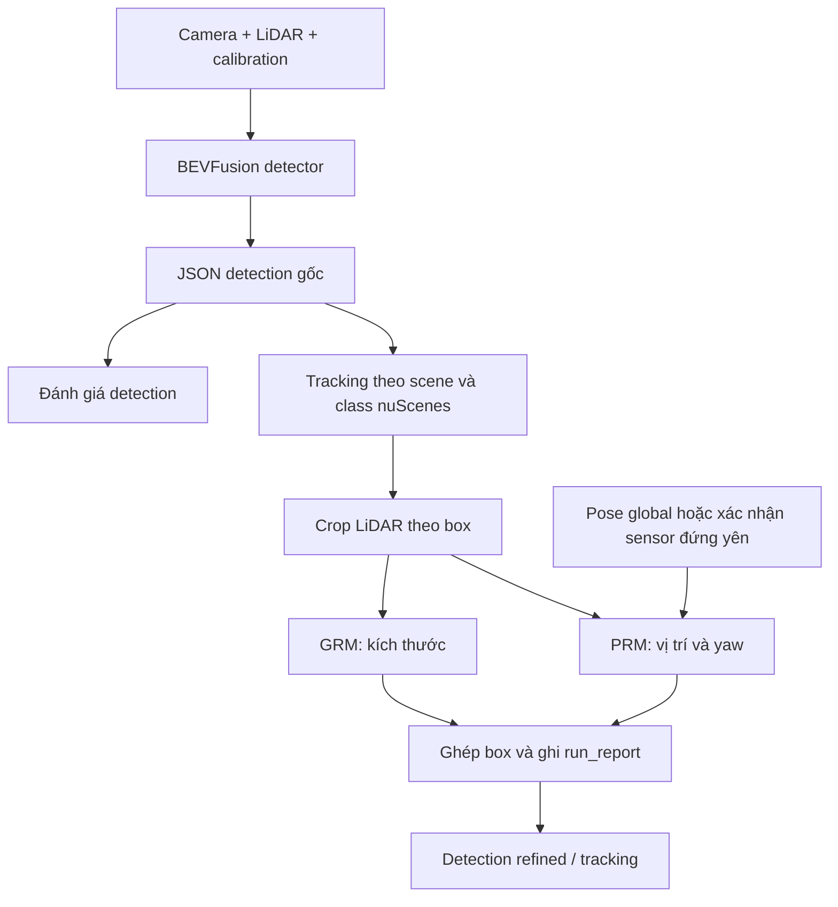

# Chạy BEVFusion và DetZero trên nuScenes-mini / VF6_01 5 Hz

Luồng thực thi nằm tại `DetZero-main-2/integration/run_pipeline.py`. Không dùng CRM.
Code được kiểm tra local bằng CPU; các lệnh inference CUDA bên dưới do người dùng chạy trên VM.
Không chuyển dữ liệu hoặc checkpoint bằng các bước này.

## Dữ liệu mới đã kiểm tra

`data/nuscenes_vf6_01_5hz`, version `v1.0-trainval`, custom validation:

- 1 scene, 155 frame; 930 ảnh 1920×1536, 155 LiDAR, 15.389 annotation, 515 instance.
- Đọc toàn bộ ảnh và 42.025.698 điểm: không thiếu file, không có điểm NaN/Inf.
- Delta-time 199,976–200,036 ms; camera lệch tối đa 2,111 ms.
- Đã đối chiếu intrinsic với K_new, camera→ego với nghịch đảo extrinsic nguồn.
- GT gồm car/motorcycle/pedestrian. `Rider→motorcycle`, `Car→car` là mapping của bộ VF.
- 903 GT có num_lidar_pts=0; số điểm này do đối tác cung cấp, chưa đếm lại trong từng box.
- Không có trajectory ego: toàn bộ pose identity. Không có GT velocity/attribute đáng tin cậy.

Dữ liệu đủ về cấu trúc để thử **detection từng frame**, chưa đủ để xác nhận tracking/PRM trong hệ global.
Kiểm tra cấu trúc/calibration không thay thế kiểm tra calibration thực tế trên ảnh và điểm LiDAR.

`pnk_infos_val.pkl` gốc tham chiếu thư mục Downloads của máy xuất. Giữ nguyên file nguồn;
converter tạo `bevfusion_infos_val.pkl` mới. Phải chạy converter trên mỗi máy đích.
Không tạo train.pkl trùng val.pkl. Chưa cấu hình fine-tuning VF trong luồng này.

## Kiến trúc và chính sách



- Adapter dùng JSON; không cần unpickle model class BEVFusion trong env DetZero.
- Giữ nguyên class nuScenes khi association. Vehicle/Pedestrian/Cyclist chỉ chọn filter/refiner.
- Tính delta-time từ timestamp; IoU BEV + GNN, một giai đoạn sau lọc score (mặc định 0.1).
- `max-gap-seconds` được đổi sang số frame theo median dt của scene (mặc định 0.6 s).
  Ngưỡng IoU, max gap, min score là tham số khởi đầu, chưa tối ưu trên VF.
- Tracking forward/reverse và refiner sử dụng nhiều frame, kể cả tương lai: đây là luồng offline.
- Không đọc ground truth để tracking/crop/refining; GT chỉ dùng trong evaluator.
- `--refinement none`: tracking. `geometry`: tracking + GRM. `full`: tracking + GRM + PRM.
- `--size_policy grm`: dùng GRM cho mọi class được chọn. `auto`: nhận GRM nếu cả ba chiều
  trong [0.75, 1.25] × median kích thước detector; nếu không, dùng median.
  `detector_prior`: bỏ GRM, dùng median detector. Đây là các chính sách cần so sánh riêng.
- Tâm box JSON là tâm hình học. Renderer không trừ h/2. `--z-policy center` giữ Z đầu ra PRM
  (hoặc Z tracking trong geometry-only). `preserve_bottom` giữ đáy box đầu vào, không ước lượng mặt đường.
- Intensity mặc định `unit` = intensity/255; có `raw`/`tanh` cho thí nghiệm.
  Normalization này chưa được hiệu chỉnh để tái tạo phân bố intensity của checkpoint Waymo.
- Nạp trọng số `strict=True`. Thiếu/mismatch checkpoint hoặc lỗi model làm dừng pipeline.
  `--allow-refine-errors` cho phép fallback và ghi rõ từng lỗi; không đếm fallback là refine thành công.
- PRM chia track dài thành cửa sổ tối đa 200 frame, thêm ngữ cảnh 16 frame hai phía.
  Không thay đổi checkpoint/time scale học được; dt tracking đúng không bảo đảm PRM được tối ưu cho 2/5 Hz.
- Detection output thay box matched một lần, giữ score, class, velocity và attribute từ detector;
  box không được xử lý vẫn giữ nguyên. Vì vậy LEAST_AGE không xóa false positive khỏi detection JSON.
- Tracking output chỉ xuất observation matched, không xuất box ngoại suy/unmatched hoặc class construction_vehicle.
  Vận tốc global tracking được tính lại từ tâm và timestamp; ego diagnostic không xuất velocity.

## Môi trường

Tiếp tục dùng hai env đang chạy ổn trên VM:

- `~/venvs/bevfusion`: BEVFusion, torchpack, MMCV và CUDA extensions đã build.
- `~/venvs/detzero`: PyTorch, NumPy, scipy, shapely, easydict, PyYAML, filterpy,
  nuscenes-devkit, Pillow, tqdm; OpenCV/ffmpeg nếu render video.

Không nâng PyTorch/CUDA chỉ để chạy các script mới. GRM/PRM bridge không cần chạy detector Waymo hoặc spconv.
Các lệnh dưới dùng `--tracking-device cpu` (Shapely) và model CUDA, không cần build lại DetZero IoU CUDA.
Có thể bỏ tùy chọn này nếu DetZero IoU CUDA đã build đúng với env hiện tại.

## 1. VF6_01: tạo infos và chạy detector trên VM

Từ bản code mới trong `~/bevfusion`, sau khi tự đưa dataset/checkpoint lên đúng vị trí:

```bash
cd ~/bevfusion
source ~/venvs/bevfusion/bin/activate
export PYTHONPATH="$PWD:$PYTHONPATH"
mkdir -p outputs/vf6_01_5hz/bevfusion

python tools/data_converter/create_vf_infos.py \
  --root-path data/nuscenes_vf6_01_5hz \
  --version v1.0-trainval

python tools/validate_nuscenes_data.py \
  --data-root data/nuscenes_vf6_01_5hz \
  --infos data/nuscenes_vf6_01_5hz/bevfusion_infos_val.pkl --full

torchpack dist-run -np 1 python tools/test.py \
  configs/nuscenes/det/transfusion/secfpn/camera+lidar/swint_v0p075/convfuser_vf6_01_5hz.yaml \
  pretrained/bevfusion-det.pth \
  --out outputs/vf6_01_5hz/bevfusion/predictions.pkl \
  --format-only \
  --eval-options jsonfile_prefix=outputs/vf6_01_5hz/bevfusion
```

Config sử dụng `load_interval: 1`, `sweeps_num: 0`, `pad_empty_sweeps: false`, không radar/map.
Chỉ ảnh/points được collect vào model. Không dùng `--eval bbox` trên VF với evaluator split chính thức.
Output JSON phải có 155 sample token, kể cả frame không có box.

Đánh giá baseline bằng env DetZero:

```bash
source ~/venvs/detzero/bin/activate
python tools/evaluate_vf_comparison.py \
  --data-root data/nuscenes_vf6_01_5hz \
  --baseline outputs/vf6_01_5hz/bevfusion/results_nusc.json \
  --output outputs/vf6_01_5hz/baseline_metrics.json
```

Báo cáo custom AP trên car/motorcycle/pedestrian, ngưỡng center-distance 0.5/1/2/4 m;
TP translation/scale/orientation error tại 2 m. Dùng thuật toán nuScenes SDK nhưng **không phải benchmark
nuScenes chính thức**, không báo NDS, velocity, attribute hoặc AMOTA global. Phạm vi: car 50 m,
motorcycle/pedestrian 40 m; mặc định loại GT zero-point. Chạy thêm `--include-zero-points`
để kiểm tra độ nhạy với số điểm đối tác cung cấp. Class prediction ngoài ba class được thống kê và bỏ qua;
điểm số không chứng minh chất lượng trên những class không được gán nhãn.

## 2. VF: thử tracking và GRM chưa bù ego motion

Đây là thí nghiệm association/shape trong các hệ ego theo frame, không phải trajectory thế giới.
GRM chuẩn hóa điểm theo từng box nhưng vẫn phụ thuộc association có nối đúng vật thể.
PRM bị chặn trong chế độ này. Không suy ra vận tốc thật hoặc chất lượng global tracking từ output.

```bash
cd ~/bevfusion
source ~/venvs/detzero/bin/activate

python DetZero-main-2/integration/run_pipeline.py \
  --results_path outputs/vf6_01_5hz/bevfusion/results_nusc.json \
  --data_root data/nuscenes_vf6_01_5hz --version v1.0-trainval \
  --classes car,motorcycle,pedestrian \
  --coordinate-mode ego --refinement geometry --size_policy auto \
  --intensity-mode unit --device cuda --tracking-device cpu \
  --output_dir outputs/vf6_01_5hz/detzero_geometry

python tools/evaluate_vf_comparison.py \
  --data-root data/nuscenes_vf6_01_5hz \
  --baseline outputs/vf6_01_5hz/bevfusion/results_nusc.json \
  --refined outputs/vf6_01_5hz/detzero_geometry/results_nusc_detzero_refined.json \
  --output outputs/vf6_01_5hz/comparison_geometry.json
```

Chạy đối chứng `--refinement none` với output_dir riêng để tách tác động của tracking.
Có thể thử `--size_policy grm` với output_dir khác để tách tác động của ngưỡng bảo vệ size.
Không lựa chọn tham số rồi công bố điểm trên cùng scene như một test set độc lập.

Output của mỗi lần chạy:

- `results_nusc_detzero_refined.json`: detection giữ toàn bộ candidate gốc, thay box matched.
- `tracks_ego_diagnostic.json`: ID/box trong hệ ego giả định, không có velocity.
- `tracks.pkl`, `refined_boxes.pkl`: kết quả trung gian để kiểm tra.
- `run_report.json`: tham số, hash input/config/checkpoint, số GRM accepted/rejected,
  PRM applied, thiếu điểm/lỗi; trạng thái riêng từng track.

Khi có odometry/SLAM/NAV thật, cần cập nhật **ego_pose, annotation global và detector JSON/infos nhất quán**
rồi chạy lại detector; không chỉ thay pose và dùng JSON cũ. Lúc đó có thể dùng `--coordinate-mode global
--refinement full`. `--assume-stationary` chỉ dùng nếu đã xác nhận sensor rig đứng yên;
không dùng để bỏ qua việc thiếu pose trên xe đang chạy.

## 3. nuScenes-mini: đầy đủ tracking + GRM + PRM

Dataset mini có 10 scene/404 frame; mini-val có 2 scene/81 frame và pose theo thời gian.

```bash
cd ~/bevfusion
source ~/venvs/bevfusion/bin/activate
mkdir -p outputs/mini-eval

torchpack dist-run -np 1 python tools/test.py \
  configs/nuscenes/det/transfusion/secfpn/camera+lidar/swint_v0p075/convfuser.yaml \
  pretrained/bevfusion-det.pth --out outputs/mini-eval/predictions.pkl \
  --eval bbox --eval-options jsonfile_prefix=outputs/mini-eval

source ~/venvs/detzero/bin/activate
python DetZero-main-2/integration/run_pipeline.py \
  --results_path outputs/mini-eval/results_nusc.json \
  --data_root data/nuscenes --version v1.0-mini \
  --coordinate-mode global --refinement full \
  --device cuda --tracking-device cpu \
  --output_dir outputs/mini_detzero_full
```

Output tracking global: `results_nusc_detzero_tracking.json`. Đánh giá detection/refining trên mini-val
là so sánh offline nội bộ vì có frame tương lai; không coi đó là detector online cùng điều kiện benchmark.
Metrics cũ trong các thư mục outputs trước đó không phải kết quả của phiên bản pipeline mới này.

## 4. Render và kiểm thử

```bash
python tools/render_vf_videos.py \
  --data-root data/nuscenes_vf6_01_5hz \
  --baseline outputs/vf6_01_5hz/bevfusion/results_nusc.json \
  --refined outputs/vf6_01_5hz/detzero_geometry/results_nusc_detzero_refined.json \
  --tracking outputs/vf6_01_5hz/detzero_geometry/tracks_ego_diagnostic.json

OMP_NUM_THREADS=2 python -m unittest discover -s tests -v
```

Video dùng FPS từ timestamp, cùng ngưỡng score giữa hai nhánh, tâm box JSON nguyên bản.
Trong ego diagnostic, đường nối ID chỉ là lịch sử tọa độ ego chưa bù, không phải đường đi trên bản đồ.
Tests gồm class isolation, empty frame/reverse, tọa độ/Z, fallback, track >200 frame,
perfect/empty prediction cho evaluator và forward thực sáu checkpoint nếu có file local.

Thử sửa crop camera và hệ tọa độ LiDAR cho VF6: [Calibration ablation](VF_CALIBRATION_ABLATION.md).
